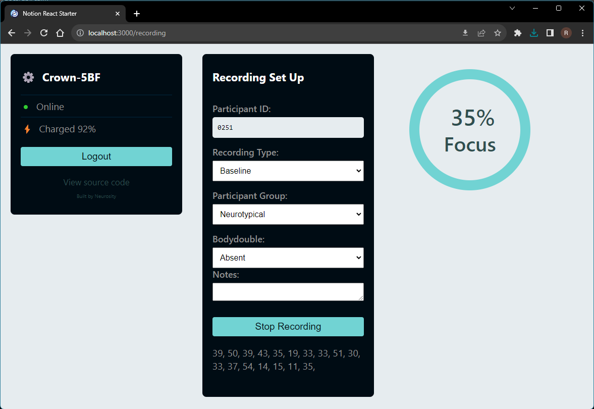

# Notion React Recording

Based off of the "Notion React Starter" available [here](https://github.com/neurosity/neurosity-react-web-starter)

Allows for the recording and saving of raw EEG data, the probability of being focused, and the probability of being calm over a duration of time to csv files.
Specifically designed for use in ADHD BCI research to determine the effects of body doubling on a person's calmness and focus.

### Getting Started

- 1️⃣ `git clone https://github.com/RyanSchuenke/neurosity-react-recording`
- 2️⃣ `cd notion-react-starter`
- 3️⃣ `npm install`
- 4️⃣ `npm start`

### The Stack

- ⚛️ Built with React - [Create React App](https://github.com/facebook/create-react-app)
- 🏆 Reach Router - [@reach/router](https://reach.tech/router)
- 🤯 NotionJS API - [@neurosity/notion](https://github.com/neurosity/notion-js)
- 🔑 NotionJS Authentication
- 👍 React Use - [react-use](https://github.com/streamich/react-use)

MIT License
